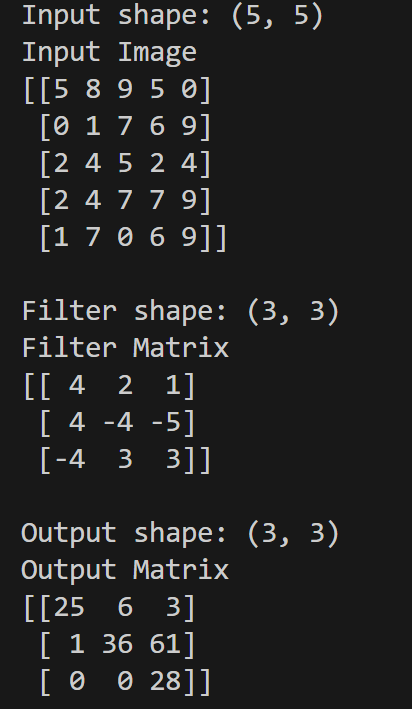
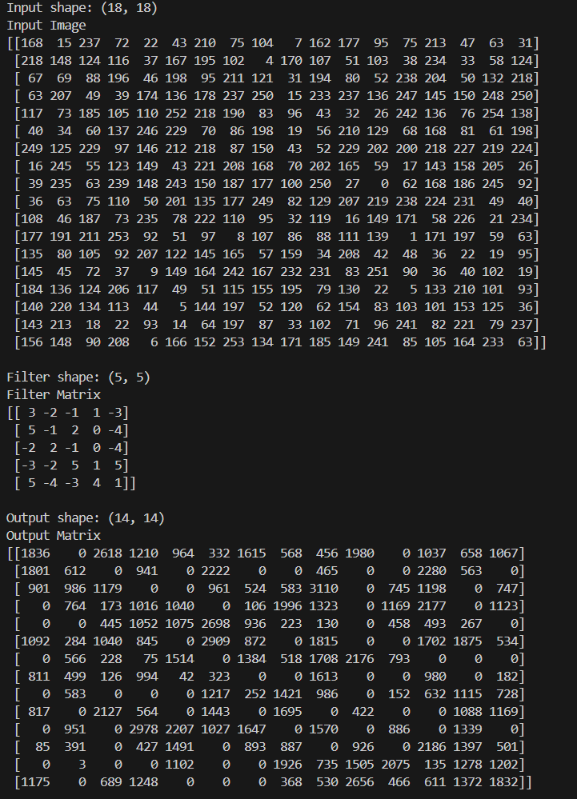

# Overview
The code performs a convolutional operation between an input image and a filter using a custom implementation that mimics the behavior of the Eyeriss systolic array architecture.

Below attached are the images for Input image of size 5x5 with a filter of size 3x3 and another image of size 18x18 with a filter of size 5x5.

